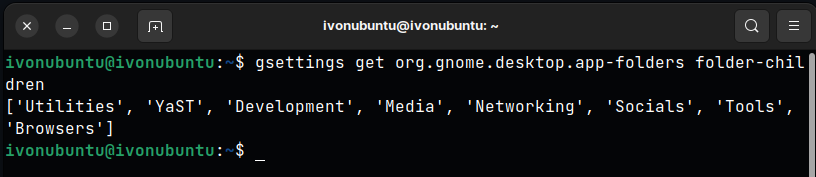

# Creating App Folders in gnome
If you're anything like me and like to keep your app list clean and cohesive, this is a great way to do it. 

*Disclaimer*: This method may not work for you if you're not on gnome ( hence the specific title ).

## Checking for already created folders
Open up your favorite terminal and run the following command:
```bash
gsettings get org.gnome.desktop.app-folders folder-children
```



## Adding a new folder
To add a new folder, you need to just add it to the array of already created folders and then set the `folder-children` to that new array.

```bash
gsettings set org.gnome.desktop.app-folders folder-children "['folder1', 'folder2', 'folder3', 'folder4']"
```


## Adding an app to a folder
To add an app to a folder, you need to add the app's desktop file to the folder's list of apps. To do this, you need to run the following command:
```bash
gsettings set org.gnome.desktop.app-folders.folder:path/to/folder apps "['app1.desktop', 'app2.desktop', 'app3.desktop']"
```
eg: 
```bash
gsettings set org.gnome.desktop.app-folders.folder:/org/gnome/desktop/app-folders/folders/tmp/ apps "['ca.desrt.dconf-editor.desktop']"
```

## Refresh the app list
To refresh the app list, you need to run the following command:
```bash
xdg-desktop-menu forceupdate
```

before update: 


after update:


*Note*: the updating command doesn't always work, sometimes a restart is required.

## Removing an app from a folder
To remove an app from a folder, you need to remove the app's desktop file from the folder's list of apps. To do this, you need to run the following command:

suppose this is the app list before removing an app:
```bash
gsettings get org.gnome.desktop.app-folders.folder:path/to/folder apps

['app1.desktop', 'app2.desktop', 'app3.desktop']
```
to remove app3, you need to run the following command:
```bash
gsettings set org.gnome.desktop.app-folders.folder:path/to/folder apps "['app1.desktop', 'app2.desktop']"
```

